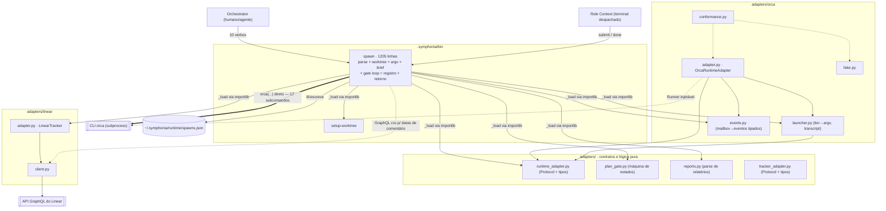
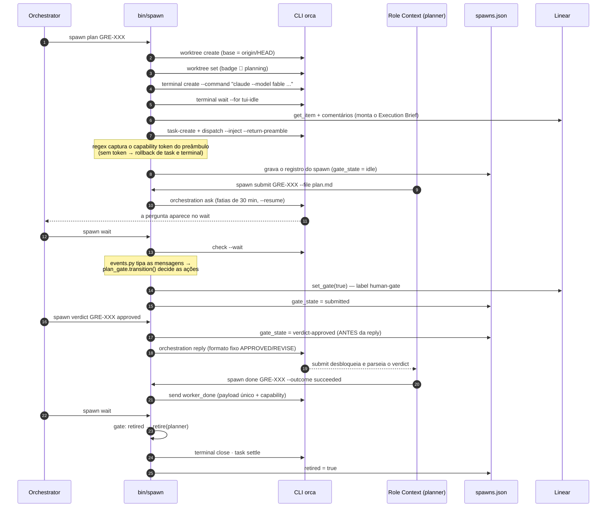
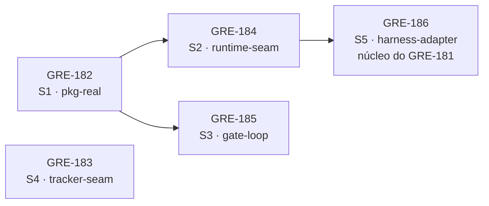

# Architecture review — briefing + análise do GRE-181 (2026-08-11)

Árvore auditada: `4d0f79f` (main). Fontes: leitura direta de `bin/spawn` e `adapters/*`, varredura exaustiva por agente, auditoria de história git/PRs por agente independente (Sonnet 5). O briefing original `docs/briefings/harness-extensibility.md` não existe mais em disco (worktree descartado); a análise usou a reprodução dele no corpo do GRE-181.

## TLDR

A dor é real e o GRE-181 acerta o destino (separar Runtime Adapter de Harness Adapter), mas subestima o problema central: o seam de runtime que ele manda "reutilizar" está **morto em produção**. O `bin/spawn` (hoje **1205 linhas**, não as 756 que o ticket cita) nunca importa o `OrcaRuntimeAdapter` — fala com o CLI `orca` por um wrapper próprio e reimplementa cada método do contrato. Pior: o spawn acumulou comportamentos medidos contra o Orca real (capability token do preâmbulo, injeção do Execution Brief, espera de tui-idle, rollback parcial, `expect_lifecycle_ok`) que o adapter não tem. "Migrar para trás do seam" não é uma extração: é retroportar ~400 linhas de conhecimento medido do spawn para dentro do adapter.

**Auditoria de história (confirmada):** `git log -S "OrcaRuntimeAdapter" --all` retorna só dois commits, ambos do PR #4 (GRE-175, onde o adapter nasceu). A bifurcação aconteceu no PR #5 (GRE-179): o achado M3 do review do GRE-175 (briefing descartado) foi fechado consertando o **spawn**, não o adapter. Os PRs #6/#7 (GRE-178) aprofundaram a divergência. O adapter ficou congelado no estado de `b2a35f5`/`3d11add` e só respira dentro da `conformance.py`. Nuance: o `launcher.py` (tier→modelo, `build_launch`) é genuinamente compartilhado pelos dois caminhos — o que divergiu é a camada de orquestração em volta.

---

## Parte 1 · O mapa: como o sistema está hoje

### 1.1 Por que parte cada pasta responde

| Pasta | Responsabilidade |
|---|---|
| `.symphonia/bin/` | A interface inteira do Orchestrator — e o problema. `spawn` (1205 linhas) é os 10 verbos da CLI e, ao mesmo tempo, política de worktree, montagem de argv, injeção de Execution Brief, gate loop, registro de spawns e verbos de retorno do papel (`submit`/`done`). `setup-worktree` (110) copia os `.env` para checkouts novos. |
| `.symphonia/adapters/` | Contratos neutros + lógica compartilhada. `runtime_adapter.py` e `tracker_adapter.py` são só tipos e Protocols (interface pura). `plan_gate.py` (115 linhas, zero imports) é a máquina de estados do Human Gate. `reports.py` (212) parseia submissão de plano, verdict e relatório final. `attention.py` e `env.py` são utilitários pequenos. |
| `.symphonia/adapters/orca/` | O Runtime Adapter do Orca — usado só por testes. `adapter.py` (441) implementa o contrato inteiro; `launcher.py` (234) é o único lugar que escreve argv de agente (tier→modelo, read-only, transcript); `fake.py` (593) é o runtime hostil de memória; `conformance.py` (387) roda o mesmo walkthrough de 11 passos contra o fake e o real. |
| `.symphonia/adapters/linear/` | O Tracker Adapter do Linear. `adapter.py` (569) implementa o protocolo inteiro + `set_gate`/`record_gate` (que estão *fora* do protocolo); `client.py` (66) é o GraphQL mínimo. Em produção o spawn usa só 3 métodos — o resto do protocolo é código morto hoje. |
| `roles/` · `skills/` · `guardrails/` · `dag/` · `reconcile/` · `hooks/` | Contratos de papel e esqueletos. `roles/*.md` são os contratos que cada Role Context lê (só o do planner é *parseado* — o template do Brief mora lá). `skills/` são ponteiros instalados pelo `install.py`. `guardrails/` são 3 scripts que só levantam `NotImplementedError`; `dag/`, `reconcile/` e `hooks/` são README sem código. |
| `docs/` · raiz | Especificação e instalação. `docs/contracts/*.prototype.ts` (~4000 linhas) são a autoridade dos contratos promovidos a Python. `install.py` instala os ponteiros de skill. Estado vivo: `~/.symphonia/runtime/spawns.json` (fora de todo checkout, de propósito — GRE-178). |

### 1.2 Grafo de comunicação entre módulos

Setas cheias = import/chamada em produção. Tracejadas = só em teste. O ponto central: **a produção não passa pelo Runtime Adapter.**

A leitura que importa: `bin/spawn` nunca importa `OrcaRuntimeAdapter`. Ele importa os *tipos* do contrato e o `launcher`, mas fala com o `orca` por um wrapper próprio (`orca()`, spawn:173). Existem inclusive **dois desembrulhadores de envelope JSON diferentes** — um no spawn (que entende rejeição de lifecycle) e um no adapter (que normaliza listas) — e cada um sabe algo que o outro não sabe.

### 1.3 Fluxo de dados e eventos: uma volta completa do planner

O que viaja como dado: Execution Brief (template no `planner.md`, preenchido do Linear), corpo do plano, verdict em formato fixo, relatório de `done` com payload único (`taskId/dispatchId/outcome` + `planApproved/approvalRounds`).

Onde mora o estado: `~/.symphonia/runtime/spawns.json` é o registro vivo (os dois lados leem; só o Orchestrator escreve). O tracker (Linear) guarda o estado canônico do ticket. O gate é replay-safe: transições são função do estado gravado, não de "já vi este evento".

A assimetria que molda tudo: a resposta de um `ask` chega só ao worker que perguntou — o coordenador nunca a vê no mailbox. Por isso o gate observa apenas `plan-question` e `worker-done`, e o verdict é gravado no registro *antes* da reply sair.

### 1.4 Os dois mundos paralelos (o achado central)

**Mundo A — produção (o que roda de verdade):** Orchestrator → `bin/spawn` → `orca()` → CLI. Tem capability token capturado do preâmbulo, Execution Brief injetado, tui-idle aguardado, badges na sidebar, gate loop e rollback parcial de spawn. Não tem Runner injetável (testes só por monkeypatch) e nenhuma conformance cobre este caminho.

**Mundo B — conformance (o que é testado):** conformance → `OrcaRuntimeAdapter` → Runner → CLI. Tem 11 passos de contrato (fake + real), writer único, fence de zumbi, drain/ack. Descarta o briefing (a própria docstring admite), não tem `--inject`/`--return-preamble`/capability, nem tui-idle, nem badge, nem base-branch. **Zero chamadas em produção.**

Pelo teste de deleção: apague o `OrcaRuntimeAdapter` hoje e a produção não percebe. O seam de runtime é real nos testes (fake + real = dois adapters) e hipotético em produção. Cada correção medida contra o Orca real entrou só no spawn — os dois mundos divergem a cada release.

---

## Parte 2 · A proposta do GRE-181: o que fecha e o que não fecha

### O que a proposta acerta (e vale manter)

- **Os dois eixos são reais.** Runtime Adapter (onde roda) e Harness Adapter (que programa ocupa o terminal) variam independentes — a separação é o corte certo, e a tabela de responsabilidades do ticket é boa.
- **`LaunchGrammar` é um módulo raso mesmo.** Interface quase do tamanho da implementação (6 campos ≈ 6 ifs); cada harness novo viraria mais campos opcionais. A crítica procede — e o campo `codex` já existe lá dentro, não testado, provando o ponto.
- **RolePolicy única.** Tier/access hoje em 3 lugares (frontmatter, `ROLE_TIERS`/`ROLE_ACCESS`, `ROLE_FILES`) com teste que só compara 2. Consolidar é ganho de localidade puro.
- **As alternativas rejeitadas estão bem rejeitadas** (adapter único criaria combinatória runtimes×harnesses; config declarativa não carrega semântica de sessão/verificação).
- **O sequenciamento é prudente:** caracterizar → extrair → só depois segundo harness. E os itens 6–11 ("Além do briefing") mostram leitura real do código.

### Onde a proposta erra ou está desatualizada

1. **"O RuntimeAdapter é bom e testado; reutilizar como base" — meia-verdade que esconde o custo.** O adapter está *funcionalmente atrás* do spawn: descarta o briefing, não injeta dispatch, não captura capability, não espera tui-idle, cria worktree sem `--parent-worktree/--base-branch/--setup`. O passo 3 do plano de migração ("sem mudar um byte do comando") não é uma extração — é retroportar ~400 linhas de comportamento medido do spawn para dentro do adapter, e é aí que mora o risco do ticket inteiro.
2. **Fatos defasados.** O spawn tem 1205 linhas (não 756); o registro já mudou para `~/.symphonia/runtime/spawns.json` com escrita atômica 0600. O item 11 pede "escrita atômica" que já existe — o que falta é *lock*: `wait` bloqueia até 15 min enquanto `verdict` escreve em outro terminal; o read-modify-write entre eles ainda pode perder atualização.
3. **O ticket ignora a metade nova do spawn: os verbos do papel.** `submit`/`done` (GRE-178) rodam noutro processo, noutro checkout, se identificam por `ORCA_TERMINAL_HANDLE` e leem o mesmo registro. O `SpawnService` proposto modela só o lado do Orchestrator; a composição precisa existir dos dois lados do fio, e o registro é a interface entre eles.
4. **O gate loop não aparece na estrutura de módulos.** `wait` + `_apply_gate_event` (~200 linhas) são o motor do workflow — mailbox → eventos tipados → máquina de estados → efeitos. No desenho proposto isso some dentro de `spawn_service.py`. Merece nome próprio (`workflow/gate_loop.py`), porque é o módulo mais profundo que o pacote já tem: `plan_gate.py` é pura, replay-safe, sem imports — o exemplo a seguir, não a exceção.
5. **"O core nunca vê string de modelo" já é quase verdade — o vazamento real é outro.** `TIER_MODELS` vive no launcher (lado Orca), não no core. Os vazamentos que o ticket não lista: o registro grava `model_requested` (spawn:613) e `status` compara alias de modelo com transcript. E `transcript_path` hardcoda `~/.claude/projects`: se o layout do CLI mudar, `observed_models` devolve `[]` e isso é indistinguível de "sessão lenta". A `TierEvidence` proposta resolve — mas esses pontos deveriam virar critérios de aceite mensuráveis.
6. **Mesma doença, outro seam.** O spawn também contorna o Tracker Adapter: GraphQL cru para datas de comentário, `getattr(tracker, "_c")` para roubar o client privado, e `set_gate`/`record_gate` fora do Protocol. O problema de fundo não é "falta o seam de harness"; é que o pacote tem o hábito de construir seams bons e passar por fora deles na produção. Consertar o harness sem nomear esse padrão convida a terceira ocorrência.

### Auditoria de história (agente independente, git/PRs)

- **PR #4 (GRE-175, `b2a35f5`)** cria `OrcaRuntimeAdapter` + conformance. Já nasce com a fissura documentada: `RoleSpec.briefing` descartado ("known limitation, deferred to the merge gate", adapter.py:9-14).
- **PR #5 (GRE-179, `dc98bdd`)** cria `bin/spawn` e `launcher.py`. O corpo do PR diz que fecha o M3 do GRE-175 consertando o spawn — o momento da bifurcação. Motivação registrada: `worker-start` não aceitava modelo/permissão; `acceptEdits` travava workers em prompt invisível; worktree puro deixava shell órfão; `worker-stop` não conhecia dispatch de `terminal create`.
- **PRs #6/#7 (GRE-178)** aprofundam: capability com rollback (spawn:463-493), tui-idle (spawn:589), `--return-preamble` (spawn:602), `expect_lifecycle_ok` (spawn:160,182,1125), `build_brief` (spawn:401,595), verbos `submit`/`done`.
- `git log -S "OrcaRuntimeAdapter" --all` → só `b2a35f5` e `3d11add` (ambos PR #4). Únicos consumidores em qualquer época: o próprio `adapter.py`, docstrings e `conformance.py:27,230,355`.

---

## Frentes de ataque (ordem e dependências)

- **GRE-182 · S1 · pkg-real** — matar o importlib sintético; `.symphonia` como pacote importável de verdade. Pré-requisito de S2 e S3. Pequeno.
- **GRE-184 · S2 · runtime-seam** — ressuscitar o seam de runtime: retroportar os comportamentos medidos do spawn para dentro do `OrcaRuntimeAdapter` (com testes de caracterização congelando os argv atuais primeiro) e fazer o spawn compor o adapter. O trabalho de verdade. Depende de S1. Desbloqueia o núcleo do GRE-181.
- **GRE-185 · S3 · gate-loop** — nomear o gate loop (`workflow/gate_loop.py` sobre `plan_gate.py`) e travar o registro (lock ou write-through serializado). Depende de S1; paraleliza com S2.
- **GRE-183 · S4 · tracker-seam** — honestidade no seam do tracker (data no `Comment`, `set_gate` no Protocol, fim do `_c` roubado). Independente; paraleliza com tudo.
- **GRE-186 · S5 · harness-adapter** — o núcleo do GRE-181 emendado: extrair `prepare()/observe()`, `RolePolicy` única, `TierEvidence` no registro no lugar de `model_requested`. Registry + `config.harness` só depois do fake existir. Depende de S2.

**Recomendação principal:** o GRE-181 está certo no destino e otimista no caminho. Antes de abrir o seam de harness, feche o seam que já existe: S1 → S2 → S5, com S3 e S4 em paralelo. A ordem importa porque cada passo torna o seguinte testável: sem S2, os testes de caracterização do ticket congelam um monólito que continuará sendo o único caminho de produção — e o Harness Adapter nasceria como o terceiro mundo paralelo, não como a solução dos dois primeiros.
