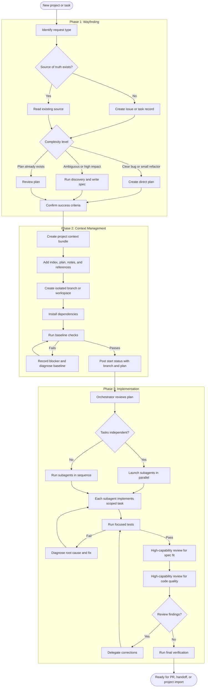

# Importable Development Workflow Briefing

## Purpose

This project will package a repeatable development workflow that can be brought into a new codebase at project start. The package should give agents and humans the same operating model: how to orient, how to preserve context, how to implement safely, and how to close work without losing the decisions that shaped it.

The workflow combines guardrails, planning practices, context files, review loops, and agent coordination patterns. A new project should be able to import the workflow and receive a clear default path for feature work, bug fixes, refactors, and pull requests.

## Current Scope

The first pass defines three major phases.

1. **Wayfinding**
   Establish the source of truth, classify the work, and decide how much planning the task needs. Simple fixes can move directly into a short plan. Ambiguous or complex work needs a stronger specification before anyone writes code.

2. **Context Management**
   Create and maintain the working context for the task. This includes the issue or task record, the implementation plan, project notes, branch or worktree setup, baseline checks, and status updates that let another agent resume the work.

3. **Implementation**
   Use an orchestrator to break the plan into coherent tasks. The orchestrator coordinates the work and review flow. Subagents handle implementation, testing, debugging, and focused fixes. Independent tasks can run in parallel. Dependent tasks run in sequence.

## Operating Principles

- Keep one source of truth for the task.
- Write down decisions before they become hidden assumptions.
- Use isolated workspaces or branches for implementation.
- Run a clean baseline before changing behavior.
- Make the orchestrator responsible for coordination, delegation, and review.
- Give subagents narrow tasks with clear inputs and outputs.
- Use tests to drive risky behavior changes.
- Treat review findings as claims that need evidence.
- Close the loop with verification notes and context cleanup.

## Mermaid Workflow

## Next Decisions

- Define the file structure that a project imports.
- Decide which guardrails belong in reusable Markdown, scripts, skills, or templates.
- Specify the minimum context bundle needed for another agent to resume work.
- Define how the orchestrator records subagent assignments and outcomes.
- Choose the first project to test the workflow against.
